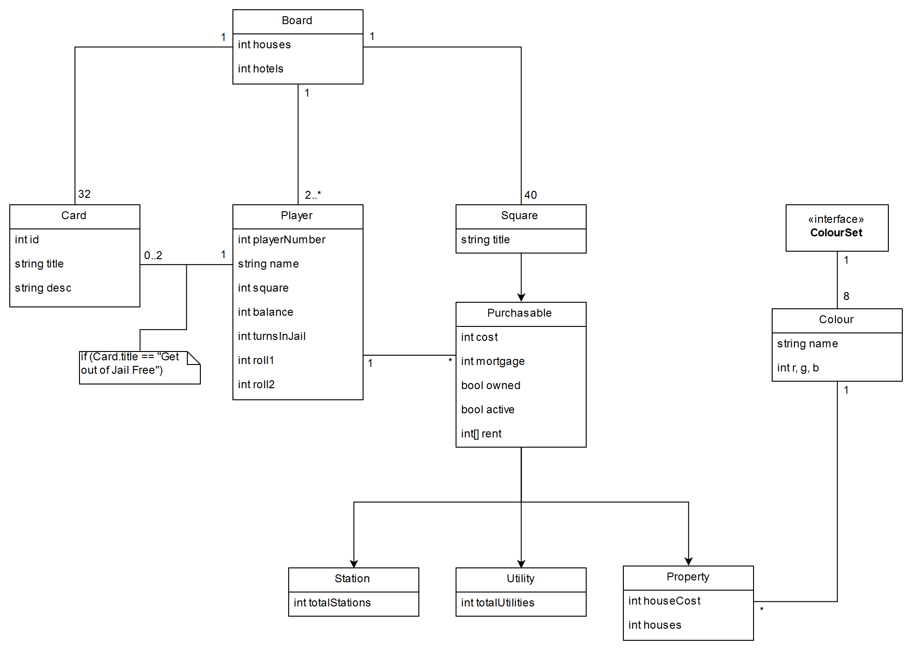
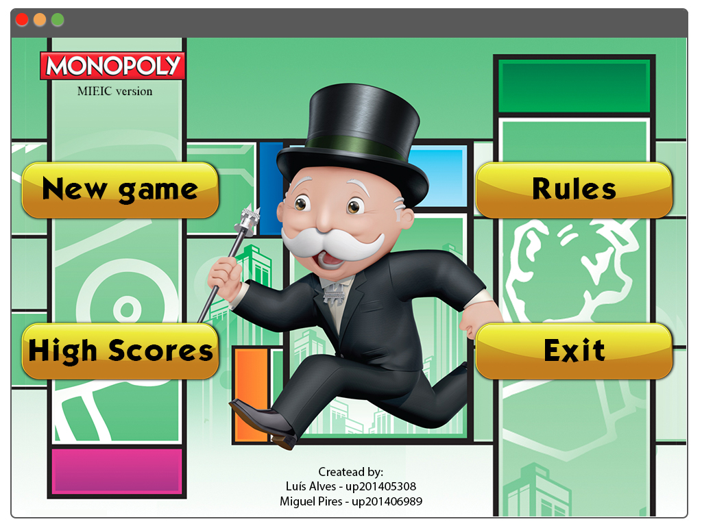
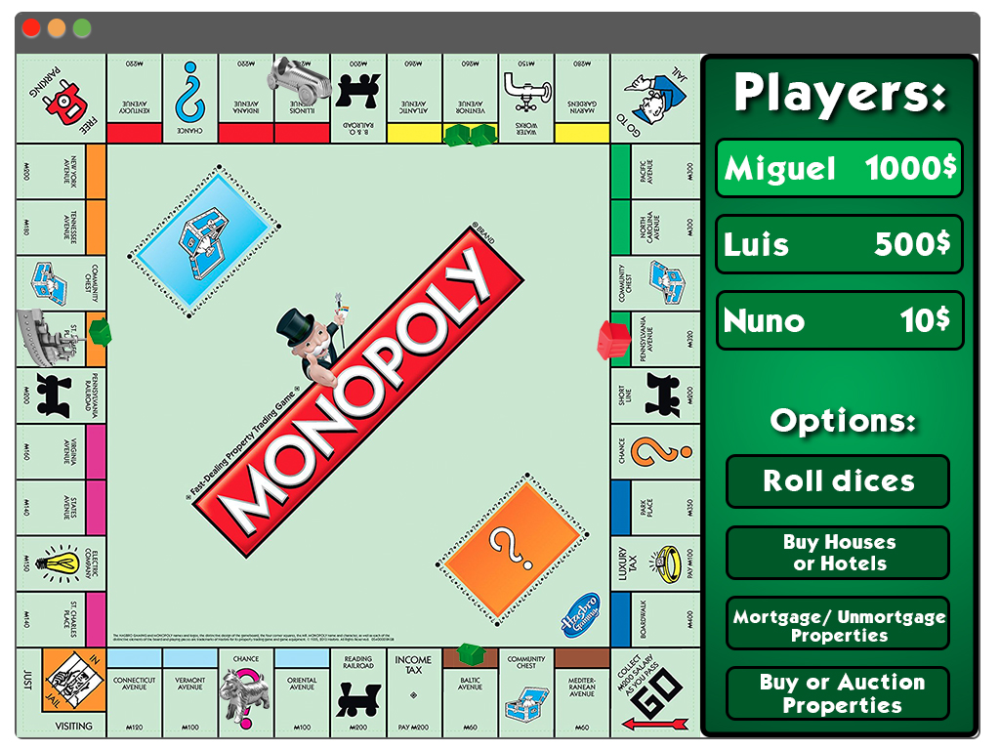

# LPOO1617_T1G3

Luís Miguel da Rocha Alves, up201405308, up201405308@fe.up.pt

Miguel Rodrigues Pires, up201406989, up201406989@fe.up.pt

## Setup/ Installation procedures
### APK file:
- Download the "monopoly.apk" file (only for Android, for now) on this branch or you can also download it here: https://feupload.fe.up.pt/get/2CiCjG0dzOwD6Rl;
- Copy the .apk file into anywhere of your mobile device's storage;
- Open your device's file manager, look for the .apk file that you copied;
- Click on it and install the game;
- Have fun!

### Jar file:
(having difficulties creating it)
## Architecture Design
#### Package and class diagram

#### Behavioural Aspects

#### Design Patterns
The design pattern we decided to use is the **Abstract Factory Pattern** because we find it the best to suit our needs.
## GUI Design
#### Main Functionalities
- New game
  - Number of Players
  - Choose pawn
  - Buy houses/hotels
  - Mortgage/unmortgage properties
  - Roll dice
  - Buy properties
  - Auction properties
- High Scores
- Rules
- Exit
#### Mock-up
##### Imagens de apresentação meramente sugestivas.

## Test Design
- Manually select dice value and check if the square on which the player lands is the expected
- Check if dice probability distribuition is equivalent to 2d6
- Check if next player is selected after the end of turn
- Check if player lands on another player's property, has enough money to cover the rent, and pays
- Check if player lands on another player's property, doesn't have enough money to cover the rent, has properties, and can mortgage them
- Check if player can acquire properties
- Check if player can't acquire houses without acquiring a property first
- Check if player can't acquire houses if not enough houses are available in the board
- Check if player can acquire houses for his properties
- Check if player acquires hotel after acquiring 4 houses
- Check if player can mortgage his properties
- Check if player plays again after double dice roll
- Check if player goes to jail after 3 double dice rolls in succession
- Check if other players can acquire property via auction after player refuses to buy it
#### Difficulties
- Time managment, because the final delivery of the project was schedule during final exams time, which limits our availability and dedication to the project;
- We started working using Libgdx, but then we found out that if we used Native Android would make things a lot easier;
- Some aspects of the game would be much better, such as the dice scene, if we could use 3D capabilities;
- Making tests to try to cover the majority of the code;
- Trying to make the .Jar file.
#### Lessons learned
- We learned to program in Java and to make the most of the code, developing good code practices;
- We learned how to work using Libgdx;
- We learned how to do an Android application/ game, using android capabilities;
- We learned about design knowledge, while working with sprites and making interfaces.
#### Time spent
We tried to work everyday in conciliation with the exams period and we worked the majority of the time together at FEUP.
With the time given, we did our best to make an almost complete, playable game. If we had more time, we would implement the AI, make better tests, and improve some aspects of the game.
We really enjoyed doing this project! After the presentation, maybe we will make a refined finished version.
#### Work distribution
Both of us worked together and equally, so we decide to assign 50% to each of us.
## User Manual
After opening the game's application, you will get to the
#### Main Menu

- **New Game** button is for you to start a new game, and it'll take you to the "Players" Scene;
- **Continue game** button will let you continue your last exited game;
- **Rules** button is to show you the rules and how to play the game;
- **Exit** button exits the application.
#### Players Menu

##### This screen is for you to choose the **number of players**. It goes up to 8 players, and you add or withdraw players using the **arrows on the top of the screen**. You can **input a name** for each player, which will display during each player's turn and you can choose whether those players are real players or the **AI** controlling them, but checking the box. You can also choose if you want the dices to be automatically generated or to roll them by yourself using the device's **accelerometer**.
##### Once the desired number of players is decided, you hit the **Play** button.
#### Play Mode

##### This is the game itself, where you can see a **board** and a **HUD**. All the pawns start at the **Go** house and its the player 1's turn. On the HUD you can see the **player's turn name**, his **money balance**, his **dice roll** and his **position on the board** (positions start counting on the GO house as 0, and increment with each house you go through the board).
##### Each turn starts by the player rolling the dices (generated automatically or manually). Then, the pawn will move from its current position to a house on the board by the sum of the numbers of the dice. When you land on a house, a windows will prompt with the informations of the landed house. If you land on a **card house** you will get the consequence of the card (a random card from a list of cards), if its a **property house** you will get several options at your disposal:
-**Acquire** button lets you buy that property, and after acquiring it, the button will change to **Improve**, which lets you buy houses in that property (if you buy 5 houses, it'll become into a hotel);
-**Auction** button lets you create an auction, in case you dont want to buy the property, and all the players can play the auction;
-**Mortgage** button lets you sell the property and all of it's houses (if any) to the Bank, just in case if you need extra-money;
-**Exit** button exits the house prompt.

##### If you have more doubts about how to play this game, check the
#### Rules Section

